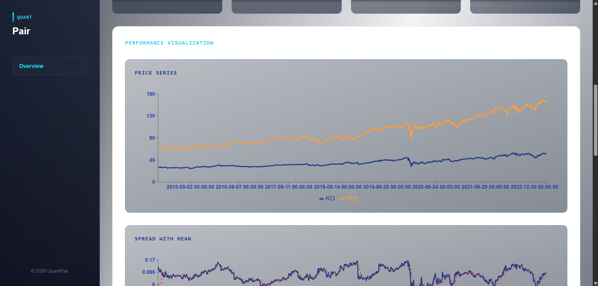
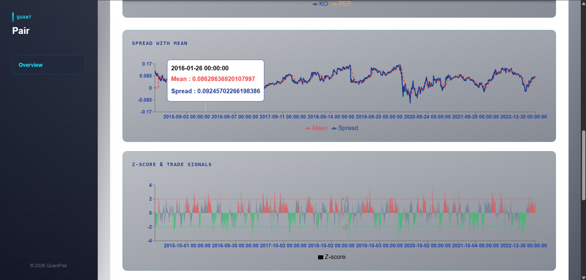

# 📈 QuantPair

**A dashboard for pair trading strategy system** 📈📊 — visualize, analyze, and manage statistically paired assets.

A complete end-to-end dashboard built with a frontend UI and backend logic to support pairs trading strategies in financial markets. 

---

## 🧠 About

QuantPair is an interactive **Pairs Trading Dashboard** that helps you:

✔ Explore statistical relationships between asset pairs  
✔ Generate trading signals using classic quantitative finance techniques  
✔ Track performance and visualize entry/exit opportunities

A perfect tool for traders, quants, and data-driven investors! 

---

## 📦 Features

| Feature | Description |
|---------|-------------|
| 📊 **Interactive Dashboard** | Frontend UI to visualize price spreads and signals |
| 📈 **Pairs Strategy Logic** | Compute co-integration and trading signals |
| 🔄 **Backend API** | Serve data and analytics securely |
| 🧪 **Strategy Testing** | Test historic data to validate signals |
| 📁 **Modular Architecture** | Separate frontend and backend projects |

---

## 🛠 Tech Stack

| Layer | Technology |
|-------|------------|
| Frontend | JavaScript / React |
| Backend | Python (FastAPI / Flask ) |
| Visualization | Chart.js |
| Deployment | Vercel / Render/ Cloud Hosting |

--

## 📁 Project Structure

```
QuantPair/
├── backend/ 
      ├── api.py
      ├── backtest.py
      ├── data_acquisition.py
      ├── hedge_ratio.py
      ├── pair_selection.py
      ├── risk_management.py
      ├── run.py
      ├── spread_signal.py
      ├── trading_rules.py
      ├── visualization_data.py
      ├── visualization.py
      └── requirements.txt             
├── frontend/quantpair/
        ├── public/
        ├── src/
            ├── pages/
            ├── api/
            └── components/
        └── index.html            
└── README.md               
```

---

## ⚙️ Installation & Setup

### 📥 Clone the Repository

```
git clone https://github.com/Arijit2175/QuantPair.git
cd QuantPair
```

### 🧠 Backend Setup

```
cd backend
pip install -r requirements.txt
```

### 🎨 Frontend Setup

```
cd frontend/quantpair
npm install
```

---

## 👀 Preview

A quick look at the **QuantPair Dashboard** and its features 📊🚀

---

### 🖥️ Dashboard View

| Feature | Preview |
|--------|---------|
| 📈 Pair Price Chart |  |
| 📊 Spread & Z-Score |  |

---

